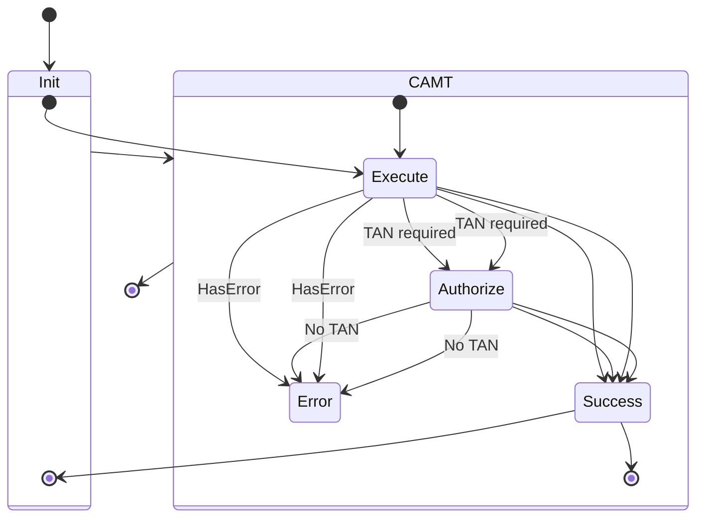

# FinTS Flows

## CAMT

```mermaid
stateDiagram

    [*] --> Init
    Init --> CAMT 
    CAMT --> [*]
    

    state Init {
      [*] --> Execute
      Execute --> Error: HasError
      Execute --> Authorize: TAN required
      Execute --> Success
      Authorize --> Error: No TAN
      Authorize --> Success
      Success --> [*]
    }

    state CAMT {
      [*] --> Execute
      Execute --> Error: HasError
      Execute --> Authorize: TAN required
      Execute --> Success
      Authorize --> Error: No TAN
      Authorize --> Success
      Success --> [*]
    }

```